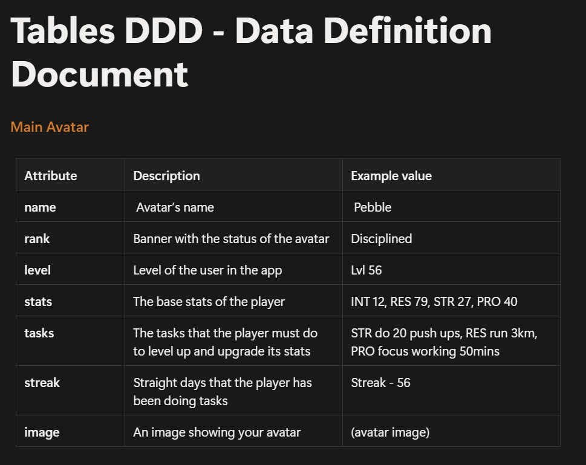
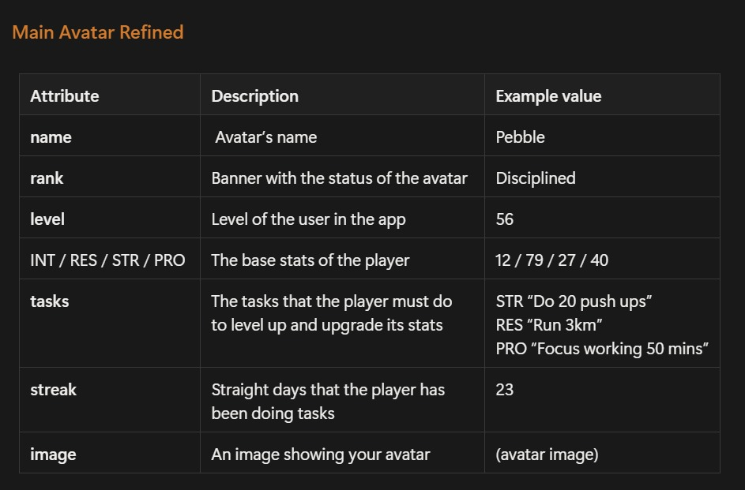
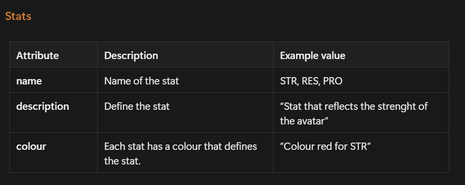

Today we worked with the wireframes we made at our last meeting this weekend.

The goal was to transform these step by step: Wireframe → DDD → ERD → Schema

Before creating any database, we identified the core identities of our application thanks to the wireframes and DDD created of all of them.

While creating the ERD, we decided to leave as a different table the stats. This decision was based on the fact that stats are not the same for each person, they can vary and be chosen depending on the goal we have (sports, study goals..). Same goes for days, since we will be able to choose more than just one day for each of the goals we want to achieve.

After analysing the different interactions inside the app, we identified the following main entities:

Users
Avatars
Stats
Tasks
Days
Posts

The first thing we noticed is that each user should only have one avatar connected to their account. The avatar acts as the visual representation of the user progression and stores things such as level, streak and rank information. Because of this, we created a one-to-one relationship between the user and avatar tables.

From there, each avatar can contain multiple stats. These stats represent different areas of personal growth, which means users are not limited to only one type of progression. For example, someone could focus on fitness goals while another person may prioritise study or productivity goals. Separating stats into their own table gives us much more flexibility later on.

Inside each stat, users can create multiple tasks. These tasks represent the actions users need to complete consistently in order to improve their progression. While discussing this structure, we realised that tasks belong only to one stat, so there was no need for an additional junction table between stats and tasks.

One of the most important parts of the ERD was deciding how to manage weekdays. At first we considered simpler approaches, but eventually we decided to create a separate days table connected through an intermediate table called task_days. This allows users to select one or multiple weekdays for each task. Since a task can happen on several days, and a day can belong to many tasks, this relationship became many-to-many.

Another entity we included was posts. Users will be able to upload posts related to their progress, achievements or experiences. Since one user can upload many posts, but each post belongs to only one user, we represented this as a one-to-many relationship.

While creating the ERD, we also discussed whether some relationships should become ternary relationships. However, after analysing the dependencies carefully, we realised binary relationships were enough for the whole structure because each entity already determined the context needed for the next one.

The finished result was the following:

After finishing the ERD, we started translating it into a relational database schema using SQLite syntax.

